# posix

**LLMs don't know the shell tools that already exist.** They reach for `tar` when `pax` is right there. They write Python scripts to hex-dump a file instead of calling `od`. They reject `readlink` as "not POSIX" even though it's been standard since 2024. Every wrong tool is wasted tokens, wasted time, and a fragile non-portable script you now have to maintain.

This project fixes that with a two-tier reference injection system — and proves it works across Claude, Codex, and Gemini.

## The Problem

POSIX.1-2024 (Issue 8) defines **155 shell utilities**. LLMs know maybe 30 of them well. The rest — `pax`, `od`, `cksum`, `uuencode`, `comm`, `tsort`, `pathchk` — are invisible. Training data is dominated by GNU/Linux blog posts and Stack Overflow answers that default to non-POSIX tools.

The result: you ask for a portable archive command and get `tar`. You ask for a hex dump and get `xxd`. You ask for a file checksum and get `md5sum`. None of these are POSIX. All of them cost you tokens explaining the wrong thing.

| You ask for | LLM suggests | POSIX answer |
|-------------|-------------|--------------|
| Portable archive | `tar` | `pax` |
| Hex dump | `xxd`, `hexdump` | `od` |
| File checksum | `md5sum`, `sha256sum` | `cksum` |
| Edit file in place | `sed -i` | `sed 's/…/' f > tmp && mv tmp f` |
| Recursive grep | `grep -r` | `find … -exec grep` |
| Resolve symlink | "not POSIX" | `readlink` (Issue 8) |

## The Solution

A two-tier progressive reference system that gives the LLM just enough context to reach for the right tool:

### Tier 1 — Discovery (`posix-core.md`)

A ~800-token semantic map of all 155 POSIX utilities, injected into the agent's context. Each utility gets a 2–5 word hook — enough to know it exists and when to reach for it.

```
[TEXT_DATA_PROC]
sed: regex stream editor (NO -i)
tr: 1-to-1 char translate/squeeze
awk: column/field logic + arithmetic
comm: side-by-side sorted-file diff (NOT diff)
```

The agent scans this and thinks: "oh, `comm` exists — I should look it up instead of writing a Python script."

### Tier 2 — Syntax Lookup (`get_posix_syntax`)

An MCP tool backed by `posix-tldr.json`. Before executing a Tier 1 utility, the agent calls this tool to get exact POSIX syntax, flags, and common traps.

```json
{
  "sed": {
    "synopsis": "sed [-n] script [file...]",
    "posix_flags": ["-n", "-e"],
    "traps": ["NO -i (GNU)", "NO -r (GNU)"],
    "example": "sed 's/old/new/g' input > output"
  }
}
```

Tier 1 tells the agent what exists. Tier 2 tells it how to use it correctly. Together, they cost under 1,000 tokens of context — and they work.

## The Proof

We tested this across three providers, 30 real shell tasks, with and without the Step-Up injection.

### POSIX Compliance: Before and After

```mermaid
---
config:
  theme: base
  themeVariables:
    primaryColor: "#bf5b2c"
    secondaryColor: "#24464e"
---
xychart-beta
  title "POSIX Compliance Rate (%)"
  x-axis ["Claude", "Codex", "Gemini"]
  y-axis "Compliance %" 0 --> 100
  bar [63.3, 58.6, 65.4]
  bar [76.7, 86.7, 86.7]
```



> Orange = Track 1 (no reference). Teal = Track 2 (with Step-Up injection).

### The Numbers

| | Claude | Codex | Gemini |
|---|:---:|:---:|:---:|
| **Track 1 Compliance** | 63.3% | 58.6% | 65.4% |
| **Track 2 Compliance** | 76.7% | 86.7% | 86.7% |
| **Improvement** | +13.4 pts | +28.1 pts | +21.3 pts |
| **Track 1 Mean Tokens** | 228 | 930 | 215 |
| **Track 2 Mean Tokens** | 374 | 1,289 | 105 |

**Gemini** got both more correct *and* more concise — output tokens dropped 51% while compliance rose 21 points.

**Codex** jumped 28 points in compliance. Token count rose because it narrates tool usage verbosely, not because it gave worse answers.

**Claude** improved 13 points. The smallest gain, but still meaningful — and the architecture is model-agnostic.

### What the Benchmark Doesn't Prove (Yet)

Tracks 1 and 2 measure compliance in a controlled text-analysis environment. No commands are actually executed. The real cost story — what happens when a wrong first answer triggers retries, debugging, and workaround scripts — is **Track 3's job**. The hypothesis: the Step-Up's small upfront cost prevents expensive downstream failure loops.

## Quick Start

No virtualenv or build step required. Pure stdlib Python 3.

```bash
# Syntax check
python3 -m py_compile run_benchmark.py

# Dry run (no API calls)
python3 run_benchmark.py --dry-run

# Run baseline (no injection)
python3 run_benchmark.py --llms claude codex gemini

# Run with Step-Up injection
python3 run_benchmark.py --llms claude codex gemini --inject-posix
```

For Gemini, add `--max-workers 1 --delay 30` if you're on a tight API quota.

## Repository Map

| File | Purpose |
|------|---------|
| `posix-core.md` | **Tier 1** — semantic map of all 155 POSIX utilities (~800 tokens) |
| `posix-tldr.json` | **Tier 2** — syntax lookup database for `get_posix_syntax` tool |
| `run_benchmark.py` | Benchmark runner — provider adapters, grading, reporting |
| `benchmark_data.json` | 30 intent-based questions with expected POSIX answers |
| `posix-utilities.txt` | All 155 POSIX Issue 8 utilities (canonical list) |

## Output Files

```
results/
  by-provider/<llm>/current/    per-question Track 1 results
  by-provider/<llm>/stepup/     per-question Track 2 results
  by-run/track1-<provider>/     aggregate summary + HTML report
  by-run/track2-<provider>/     aggregate summary + HTML report
  by-run/final-comparison/      three-way comparison report
```

Results are gitignored and not committed.

## Notes

- POSIX.1-2024 Issue 8 is canonical: [pubs.opengroup.org](https://pubs.opengroup.org/onlinepubs/9799919799/idx/utilities.html)
- `readlink`, `realpath`, and `timeout` are POSIX in Issue 8. Models trained pre-2024 incorrectly reject these — that's a scoreable failure.
- Gemini is safe at one call every 30 seconds, max 50 calls/day on most accounts. Track 2 may exceed the daily limit since the Step-Up simulation can trigger a second call per question.
- Codex uses `--skip-git-repo-check` for benchmark execution context.

## Further Reading

- [Architecture](docs/architecture.md) — how the two-tier system works
- [Benchmark Methodology](docs/benchmarks.md) — how we measure
- [Test & Regression](docs/test-and-regression.md) — validation procedures
